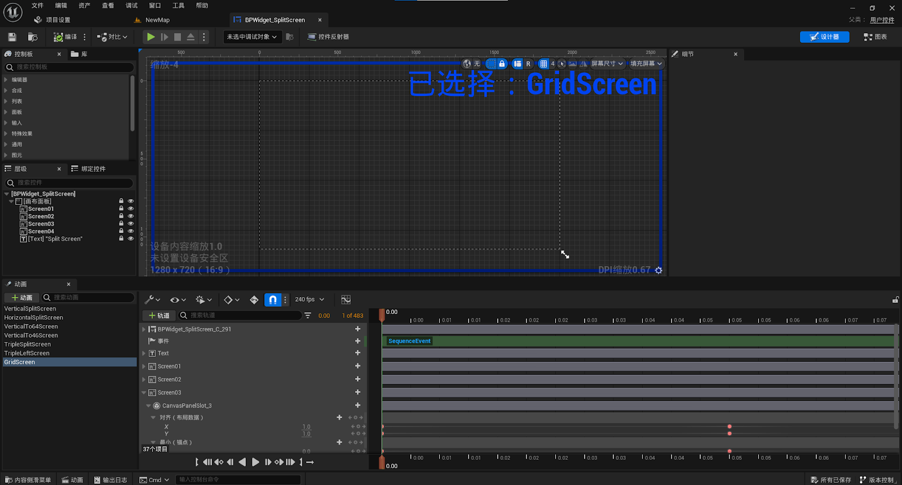

# SplitScreenPlugin
This is a non-invasive local player split screen animation plugin that supports basic 2-4 person split screen animation.

Marketplace: [Link](https://www.fab.com/listings/f88098ab-7600-46d6-9884-c4adbadb67d8)

## Overview.
What does our SplitScreenPlugin?

SplitScreenPlugin for your games and applications. Adjust the position and size of the screen as you like.This is a non-invasive local player split screen animation plugin that supports basic 2-4 person split screen animation.

1. Activation plugin.

2. Next Step. You need to put an actor BP_SplitScreenActor on the stage.

**Max SplitScreen Players** - This is the number of viewports on the screen.

## DemoMap
1. Open DemoMap and you will see two CubeCharacters in the scene, as well as the added SplitScreenActor in the outline.

<u>Open Content -> DemoMap</u>

2. Open LevelBlueprint and you will see some scripts that contain operations to execute split screen animations.

3. EventBeginPlay executes the creation of local players and dynamically creates the number of local players based on the number of added PlayerControllers in the scene.

4. Bind keyboard keys in LevelBlueprint to perform split screen animation, and of course, during use, other Blueprints can also directly call animation functions.

**RestoreAnimation** is required before switching to other split screen animations.

**Key 1**: Vertical split screen

**Alt + Key** 1: Horizontal split screen

**Key 2**: Vertical split screen 6:4

**Alt + Key 2**: Vertical split screen 4:6

**Key 3**: Tripartite screen Of Top

**Alt + Key 3**: Tripartite screen Of Left

**Key 4**: Grid split screen

**Key 0**: Restore Split Animation

**Alt + Key 0**: Restore Unreal Engine's preset split screen layout

<u>After starting the game(DemoMap), you can press the bound buttons to view the split screen animation, or use the keyboard and mouse (GamePad) to control their respective CubeCharacters to observe the scene.</u>

## Actor will create a Widget to add a screen
<u>Open Content -> BPWidget_SplitScreen</u>

The animation in the Widget is a local player split screen animation, with the animation in Executed in BP_SplitScreenActor

## Using the C++ class, the function was added in actor BP_SplitScreenActor.

This function is responsible for creating data for your viewports.

This feature is used to restore the default viewport settings of the Unreal Engine

## Function Screen Setting Parameter

**XSize**: 0~1 Proportion of screen width occupied.

**YSize**: 0~1 Proportion of screen height occupied.

**XPosition**: 0~1 Ratio of distance to the left side of the screen.

**YPosition**: 0~1 Ratio of distance to the top side of the screen.

### Features:
1. You can adjust the size of the viewport through the animation in the widget
2. You can also customize the animation for adding viewport sizes
3. Can be run at runtime and in the editor
4. Can dynamically adjust the size of the viewport
5. Customizable Widget Display in Viewports

### Nots:
1. The maximum number of screens is 8, with a default of 4. It is recommended to use a maximum of 8 split screens.
2. If you add more than 4 local players, the position and size of the viewport need to be customized.
3. If you want to customize viewport animations, you can refer to existing animation sequences.

Number of Blueprints: 1 Widget,1 Actor

Code Modules: SplitScreenPlugin (Runtime)

Number of C++ Classes: 1 Class

Network Replicated: No

Supported Development Platforms: Windows

Supported Target Build Platforms: Win64, Win32, Linux, Mac, IOS, Android

